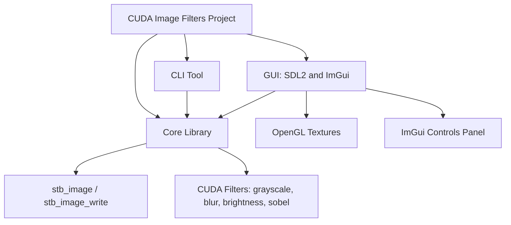
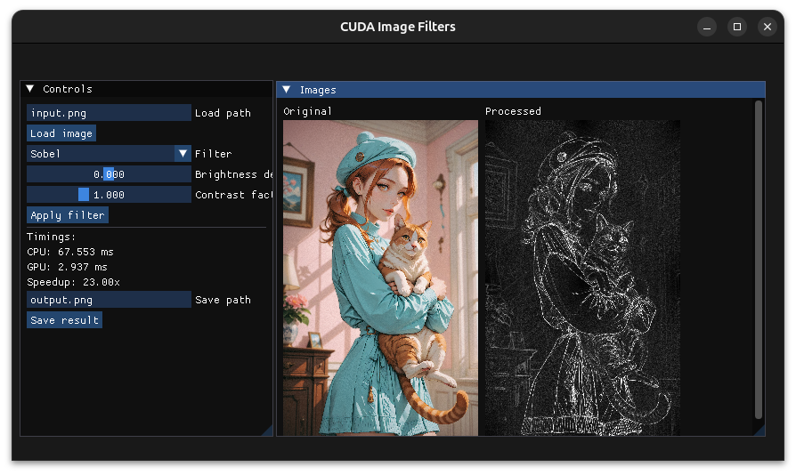

# CUDA Image Filters (CLI + GUI)

Small C++20 + CUDA demo that loads images, runs a handful of GPU-accelerated filters, and exposes both a console tool and an SDL2 + Dear ImGui viewer.

## Features
- Core library with stb-based load/save and CUDA kernels (grayscale, brightness, contrast, box blur, Sobel).
- CLI tool: apply filters from the terminal.
- GUI: view original/processed images, tweak parameters, and save results.

## Architecture



The project is split into three main components:

- **Core Library** — image type, CUDA and CPU filters, stb helpers.
- **CLI Tool** — batch image processing, calling the core directly.
- **GUI Tool** — SDL2 + OpenGL + Dear ImGui interface with real-time previews and CPU/GPU timing.


## Dependencies (Ubuntu 24.04)
- CUDA Toolkit (nvcc + runtime).
- CMake ≥ 3.20, a C++20 compiler.
- SDL2 dev: `sudo apt install libsdl2-dev`.
- OpenGL dev (Mesa): `sudo apt install mesa-common-dev libgl1-mesa-dev`.
- GLEW dev: `sudo apt install libglew-dev` (used as the OpenGL loader for ImGui).
- Dear ImGui and stb headers:
  - Option A: place them in `third_party/` as:
    - `third_party/stb_image.h`
    - `third_party/stb_image_write.h`
    - `third_party/imgui/` (official repo contents, include `backends/imgui_impl_sdl2.cpp` and `imgui_impl_opengl3.cpp`; ImGui will use the GLEW loader).
  - Option B: build with `-DUSE_FETCHCONTENT_STB=ON` and/or `-DUSE_FETCHCONTENT_IMGUI=ON` to let CMake fetch them (requires network).

## Build
```bash
mkdir build && cd build
cmake .. -DCMAKE_BUILD_TYPE=Release
cmake --build .
```

## Usage
### CLI
```bash
./cuda_image_filters_cli input.png output.png grayscale
./cuda_image_filters_cli input.png out_bright.png brightness 0.2
./cuda_image_filters_cli input.png out_contrast.png contrast 1.5
./cuda_image_filters_cli input.png out_blur.png blur
./cuda_image_filters_cli input.png out_sobel.png sobel
```

### GUI
```bash
./cuda_image_filters_gui
```
- Enter a load path and click **Load image**.
- Pick a filter (adjust brightness/contrast sliders as needed).
- Click **Apply filter** to run it on the GPU.
- Use **Save result** to write the processed image.

Example GUI screenshot:



## Notes
- Images are normalized to 8-bit interleaved RGB; alpha is discarded on load.
- Kernels are straightforward, prioritizing readability over heavy optimization.
- The ImGui build uses the OpenGL3 + SDL2 backends with the GLEW loader.

### GPU Warm-Up & First-Run Performance Behavior
- The very first CUDA filter call can be significantly slower because the CUDA context is created, allocators warm up, kernels may JIT-compile, and the GPU may ramp up clock states.
- Subsequent runs are much faster since the context is initialized and kernels are ready; this is expected behavior, not a bug.
- For fair CPU vs GPU comparisons, ignore the first GPU timing and measure later runs.
- Larger images typically see a greater benefit from GPU acceleration.
- Tip: issue a one-time “warm-up” filter call before benchmarking to get more consistent timings.
